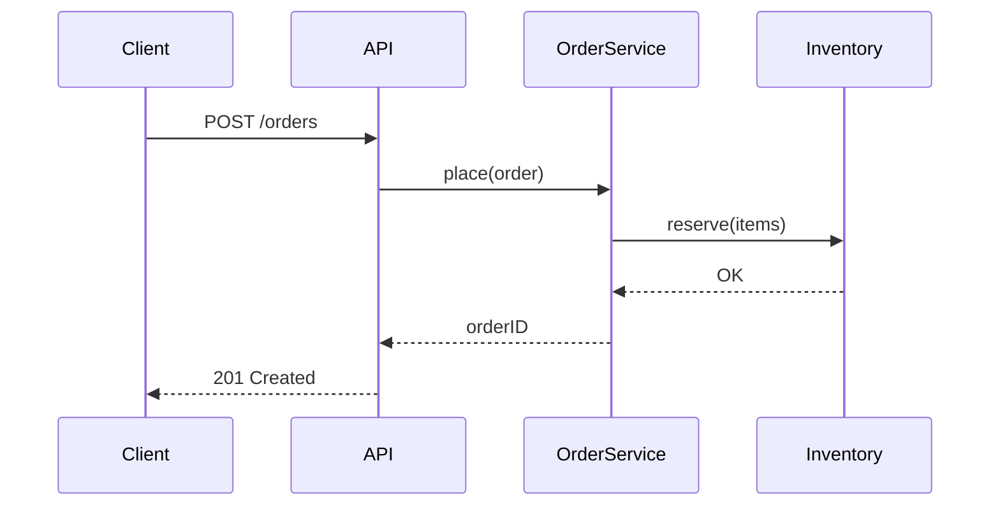

# Visual Artifacts

For visible changes, **show, don't describe**. A 15-second screen
recording compresses 20 minutes of review.

## When to Include

### UI changes (non-negotiable)

If your PR changes anything users see:

- Before / after screenshots.
- A short video for interactions.

Without these, the reviewer is reviewing blind. Don't ship UI without
visuals.

### CLI output

Paste the actual command output:

```markdown
## Before
$ mytool process foo.txt
Error: unexpected argument

## After
$ mytool process foo.txt
Processed 12 lines.
```

Code blocks copy/paste cleanly into PR descriptions.

### API changes

Show the actual request/response:

```markdown
## Before
GET /api/orders/123
{"items": [{...}, {...}]}

## After
GET /api/orders/123
{"items": [{...}, {...}], "totalCount": 2, "page": 1}
```

Reviewers can immediately see the shape change.

### Performance changes

Benchmark numbers, with methodology:

```markdown
## Before
benchmark | iterations | time/op
Process   |       1000 | 1.2 ms

## After
benchmark | iterations | time/op
Process   |       1000 | 0.4 ms

Methodology: `go test -bench=BenchmarkProcess -benchtime=10s -count=5`.
Run on M2 Pro, no other load.
```

No numbers, no merge. "Should be faster" isn't evidence.

### Data shape changes

Example records before and after:

```json
// Before
{"id": "123", "name": "Alice"}

// After
{"id": "123", "name": "Alice", "createdAt": "2026-01-15T10:30:00Z"}
```

Especially important for migration PRs.

## Taking Screenshots

### macOS

- `Cmd+Shift+4` — region screenshot.
- `Cmd+Shift+5` — flexible capture (window, recording).

### Linux

- `gnome-screenshot -a` — region.
- `flameshot` — feature-rich.

### Windows

- `Win+Shift+S` — Snipping Tool.

### Best practices

- Crop to relevant area; don't show your whole desktop.
- Hide PII (real emails, names) — use sample data.
- Two screenshots stacked beats one big collage.

## Recording Video

For interactions:

### Tools

- **macOS Screen Recording** (Cmd+Shift+5 → Record).
- **OBS Studio** (cross-platform, free, powerful).
- **Loom** (browser-based, easy sharing).
- **Cleanshot X** (macOS, polished).
- **vhs / asciinema** (for terminal recordings).

### Keep it short

- < 30 seconds for most PRs.
- < 2 minutes for complex features.
- Use captions if the video shows multiple things.

Long videos go unwatched.

### File size

GitHub limits attachments to ~10 MB for images, ~100 MB for videos.
Compress before upload:

```bash
# convert to small mp4
ffmpeg -i input.mov -vcodec h264 -acodec aac -crf 28 small.mp4

# or gif (smaller but worse quality)
ffmpeg -i input.mov -r 10 -t 15 small.gif
```

For terminal recordings, [vhs](https://github.com/charmbracelet/vhs)
produces excellent small GIFs from scripts.

## Benchmarks

### Be reproducible

A benchmark someone else can't run is suspect. Include:

- Hardware (CPU model, RAM).
- OS and version.
- Build flags (`--release`, etc.).
- The exact command.
- Number of runs.

### Use the project's tooling

Most ecosystems have benchmark frameworks:

- Go: `go test -bench=...`
- Rust: `cargo bench`, `criterion`
- Python: `pytest-benchmark`
- Java: `JMH`
- JS: `tinybench`, `benchmark.js`

Use them so others can reproduce.

### Statistical significance

A single run can be misleading. Multiple runs, take mean / median /
range:

```
Before: 1.21 ms (median, n=5; min 1.18, max 1.25)
After:  0.41 ms (median, n=5; min 0.38, max 0.43)
Speedup: ~3x
```

For small changes (< 10%), use proper statistical tests.

## Diagrams

For architectural changes, a diagram helps:

### Mermaid (renders in GitHub markdown)



### Hand-drawn / whiteboard photos

Even rough sketches are fine. Maintainers care about understanding,
not polish.

### Tools

- Excalidraw (excalidraw.com)
- draw.io / diagrams.net
- Mermaid (in markdown)
- PlantUML (text-to-diagram)

## Before/After Comparisons

For visual changes, side-by-side is clearest:

```markdown
| Before | After |
|---|---|
|  |  |
```

GitHub renders tables of images cleanly.

## Embedding vs Linking

- **Embed** images / short videos directly in the PR description.
- **Link** longer videos (Loom, YouTube) to keep description scannable.

```markdown
[Watch demo (1m20s)](https://loom.com/...)
```

## Privacy in Visuals

Before sharing:

- Blur or replace real names, emails, customer data.
- Don't expose internal URLs or hostnames.
- Don't show production data, even by accident.
- For browser DevTools screenshots: check the URL bar and request
  headers.

A "redact" pass on every screenshot before publish.

## Accessibility

When the audience is wider than your team:

- Add alt text to images:

```markdown

```

- For videos, include captions or a written summary for reviewers who
  can't watch in their environment.

## Comparing Performance Across Commits

For ongoing perf work, automate:

```bash
# benchmark-commit.sh
git checkout $1
make benchmark > "/tmp/bench-$1.txt"

./benchmark-commit.sh main
./benchmark-commit.sh HEAD
diff /tmp/bench-main.txt /tmp/bench-HEAD.txt
```

Or use tools like `hyperfine` for command-line benchmarks.

## Anti-Patterns

### "It looks fine"

Without screenshots, "looks fine" doesn't help reviewers verify.

### Massive screenshots

Don't paste your whole monitor. Crop.

### Animated GIFs > 5 MB

Optimize. Use a tool to reduce frames / colors. GitHub will reject
huge files anyway.

### Screenshots showing real customer data

A surprisingly common mistake. Triple-check before pasting.

## See Also

- [pr-description.md](pr-description.md) — visuals go inside the description
- [../14-advanced/performance-investigation.md](../14-advanced/performance-investigation.md) — benchmarking depth
